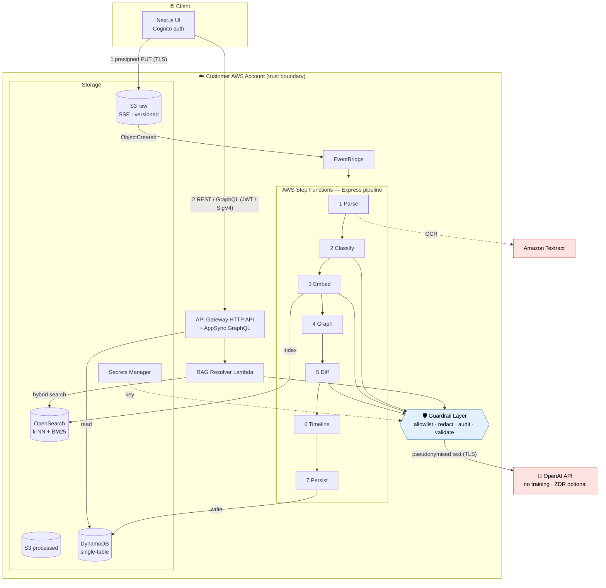
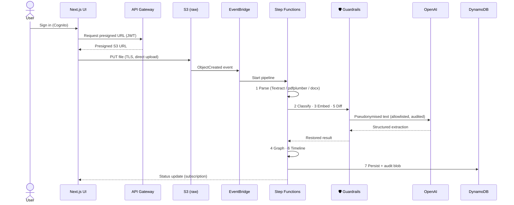
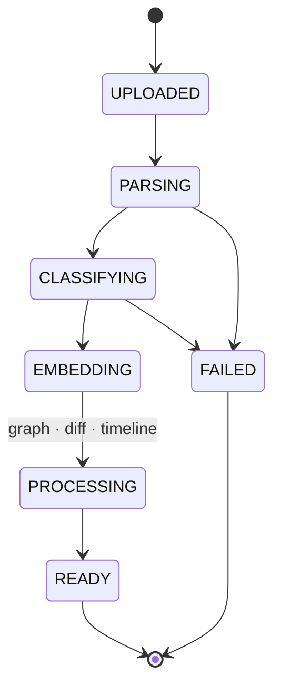
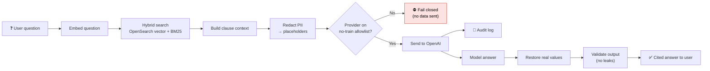
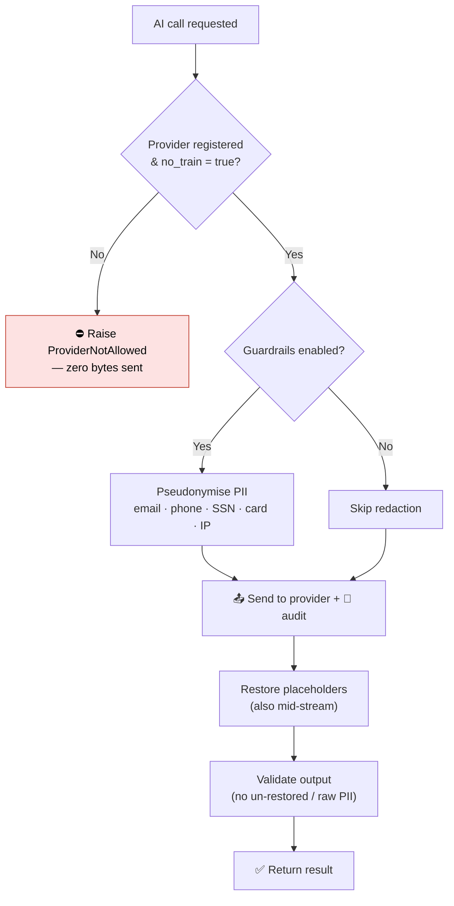
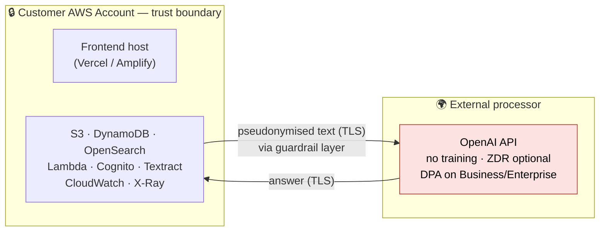

# Blue‑IQ SOW Analyser — Project Overview, Architecture & Security

**Audience:** Client stakeholders (technical and non‑technical), security reviewers.
**Last updated:** 2026‑06‑16
**Status legend:** ✅ Implemented · 🔶 Configurable / recommended next step · 🧭 Roadmap

> 📊 **Diagrams:** the flowcharts in this document are written in **Mermaid** and
> render as visuals automatically on GitHub, GitLab, VS Code (Markdown Preview
> Mermaid Support), Notion, and most Markdown viewers. To export to PDF/PNG for a
> deck, paste any diagram into <https://mermaid.live>.

---

## 1. Executive summary

Blue‑IQ is an **enterprise contract‑intelligence platform**. It ingests Statements of
Work (SOW), Master Service Agreements (MSA), and Amendments; runs them through an
AI pipeline that extracts every clause, figure, date, party, and obligation; tracks
how those terms change across amendment chains; and lets users ask plain‑English
questions about a contract and get **grounded, citation‑backed answers**.

The system is built **AWS‑native** and **serverless**, so it scales with load and
has no always‑on servers to patch. All customer data stays inside the customer's
own AWS account, encrypted in transit and at rest. The only third party that ever
sees document text is **OpenAI**, used strictly as an inference API — its data is
**not used to train OpenAI's models**, and the platform adds a dedicated
**guardrail layer** that pseudonymises personal data before it is sent, enforces a
no‑training provider allowlist, audits every call, and validates every response.

---

## 2. What the product does (capabilities)

- **Document ingestion** — upload PDF (born‑digital or scanned) and Word documents.
- **AI extraction** — structured anatomy of each contract: identification, scope,
  deliverables, timeline & milestones, commercials (TCV, rate cards, payment
  schedules), SLAs, personnel/governance, and amendment deltas.
- **Validation agent** — a second AI pass re‑reads the document, returns canonical
  figures with verbatim source quotes, and checks that *base + Σ amendments = total*.
- **Version & lineage tracking** — links amendments to their parent SOW/MSA and
  builds the chain.
- **Diff & impact** — field‑level changes between versions, each with an impact score.
- **Timeline replay** — initial state → current state → expected future state.
- **Semantic + keyword search** — hybrid vector + full‑text search across clauses.
- **Sonar / Bluely Co‑pilot (RAG)** — ask questions; answers cite the exact clause.
- **SOW drafting** — generate a first‑draft SOW from a questionnaire, then revise it.
- **Compliance grading** — grade contracts against configurable compliance packs.
- **Dashboards** — renewals, insights, audit trail, team management, per‑project views.

---

## 3. Technology stack

### 3.1 Frontend (`sow-analyzer`)
| Layer | Technology |
|---|---|
| Framework | **Next.js 16** (App Router), **React 19** |
| Language | **TypeScript 5** |
| Styling | **Tailwind CSS 4**, Radix UI, shadcn, framer‑motion, GSAP |
| Data / state | **TanStack Query** & **TanStack Table**, **Zustand** |
| Charts | Recharts |
| Auth (client) | **Amazon Cognito** (`amazon-cognito-identity-js`) |
| Docs | `mammoth` (DOCX render), `date-fns` |
| Hosting | Vercel / Amplify / static export (configurable) |

### 3.2 Backend (`sow-analyser-backend`)
| Layer | Technology |
|---|---|
| Compute | **AWS Lambda** (Python 3.12, ARM64) |
| Orchestration | **AWS Step Functions** (Express workflow, 7 stages) |
| Events | **Amazon EventBridge** (S3 ObjectCreated → pipeline) |
| API | **AWS AppSync** (GraphQL, subscriptions, streaming RAG) + **API Gateway HTTP API** (REST) |
| Storage | **Amazon S3**, **Amazon DynamoDB** (single‑table), **Amazon OpenSearch** (k‑NN + BM25) |
| Auth | **Amazon Cognito** (JWT) + **IAM/SigV4** + dev API key |
| Secrets | **AWS Secrets Manager** |
| OCR | **Amazon Textract** (scanned) + `pdfplumber` (born‑digital) + `python-docx` |
| Observability | **CloudWatch** (structured JSON logs) + **AWS X‑Ray** (tracing) |
| IaC | **AWS CDK (TypeScript)** + Terraform (parallel definitions) |
| AI | **OpenAI API** — `gpt-4.1-mini` (chat), `text-embedding-3-small` (embeddings) |
| Libraries | `boto3`, `openai`, `httpx`, `tenacity`, `orjson`, `opensearch-py`, `aws-lambda-powertools` |

---

## 4. End‑to‑end architecture & data flow

### System architecture

*Every OpenAI call — whether from the pipeline (Classify/Embed/Diff) or the RAG
resolver — is routed through the guardrail layer. Nothing reaches OpenAI directly.*

### 4.1 Upload & processing flow

1. User signs in (Cognito) and requests a **presigned S3 URL** from the API.
2. Browser uploads the file **directly to S3** over TLS — bytes never transit a
   Lambda or third‑party server.
3. S3 `ObjectCreated` emits to **EventBridge**, which starts the **Step Functions**
   pipeline.

**Document lifecycle states:**

### 4.2 Processing pipeline (7 stages)
| # | Stage | What it does | External calls |
|---|---|---|---|
| 1 | **Parse** | Extract text (pdfplumber for digital, Textract OCR for scanned, python‑docx for Word) | Textract (AWS) |
| 2 | **Classify** | OpenAI structured‑JSON extraction of the full contract anatomy + validation agent | OpenAI |
| 3 | **Embed** | Clause‑level embeddings → indexed into OpenSearch; cached in DynamoDB by content hash | OpenAI |
| 4 | **Graph** | Detect parent document, write adjacency/lineage edges | — |
| 5 | **Diff** | Field‑level change list + impact score vs parent | OpenAI (impact rationale) |
| 6 | **Timeline** | Replay amendments into initial/current/future state | — |
| 7 | **Persist** | Final DynamoDB writes + audit blob to S3; publishes status to subscribers | — |

### 4.3 Query & RAG flow
- Dashboards read from DynamoDB (via AppSync VTL resolvers and the REST API).
- **Ask Sonar/Bluely**: the question is embedded → **hybrid search** (vector + BM25)
  over the tenant's clauses in OpenSearch → the retrieved clauses + question are
  sent to OpenAI with a strict "answer only from context, cite the clause" prompt →
  the answer streams back (AppSync subscription) or returns as JSON (REST).
- Every RAG call passes through the **guardrail layer** (Section 6.4).

---

## 5. Data storage model

| Store | Contents | Notes |
|---|---|---|
| **S3 raw bucket** | Original uploaded files | SSE‑S3 (AES‑256), versioned, lifecycle → IA@30d → Glacier@90d, block‑public, TLS‑enforced |
| **S3 processed bucket** | Extracted JSON, diff snapshots, audit blobs | SSE‑S3, versioned, lifecycle → IA@60d, block‑public |
| **DynamoDB (single‑table)** | Documents, Versions, Changes, Lineage, Projects, tenant settings | Composite keys; on‑demand; **PITR** on; encryption at rest; Streams; TTL |
| **OpenSearch** | `clause-vectors` (k‑NN HNSW, 1536‑dim) + `clause-text` (BM25) | Encryption at rest + node‑to‑node + HTTPS enforced |
| **Secrets Manager** | OpenAI API key | Read at runtime by Lambdas; never in source/logs |

**Multi‑tenancy:** every record is scoped by `tenant_id`. The tenant is derived
from the **verified Cognito JWT claim** (`custom:tenantId`), and tenant‑scoped
listing uses a dedicated GSI. Cross‑tenant reads are not possible through the API.

---

## 6. Security & data protection

> This section is the core of the client review. Each control is marked
> ✅ Implemented, 🔶 Configurable, or 🧭 Roadmap.

### 6.1 Encryption
- ✅ **In transit:** TLS enforced end‑to‑end — S3 (`enforceSSL`), OpenSearch
  (`enforceHttps`, TLS 1.2), DynamoDB/AppSync/API Gateway over HTTPS, OpenAI over HTTPS.
- ✅ **At rest:** S3 SSE‑S3 (AES‑256); DynamoDB AWS‑managed KMS encryption;
  OpenSearch encryption at rest + node‑to‑node encryption.
- 🔶 **Customer‑managed keys (CMK):** can be upgraded from AWS‑managed to
  customer‑managed KMS keys on S3/DynamoDB/OpenSearch for stricter key governance.

### 6.2 Authentication & authorization
- ✅ **End users** authenticate via **Amazon Cognito**; the frontend attaches the
  **Cognito ID token (JWT)** to every backend call; the API Gateway JWT authorizer
  verifies it and the backend derives the tenant from a **verified claim**.
- ✅ **Service‑to‑service** calls (Next.js server actions, pipeline Lambdas
  publishing subscription events) use **IAM + SigV4**.
- ✅ **Least‑privilege IAM:** each Lambda is granted only the specific resources it
  needs (e.g. the RAG resolver gets DynamoDB *read*, processed‑bucket *read*, the
  OpenAI secret *read*, OpenSearch HTTP, and rights to a *single* AppSync mutation).
- 🔶 **Dev API key:** AppSync has a 365‑day dev API key as a secondary auth mode —
  rotate or remove for production.

### 6.3 Network & access boundary
- ✅ S3 buckets **block all public access**; CORS is restricted to the configured
  Next.js origin only.
- ✅ OpenSearch access policy is **scoped to the AWS account** and narrowed further
  by per‑principal IAM policies.
- 🧭 **VPC isolation:** OpenSearch runs IAM‑gated but outside a VPC in v1. For
  production hardening, place OpenSearch (and Lambdas) inside a **private VPC** with
  VPC endpoints so the search domain has no public endpoint.

### 6.4 AI data handling & guardrails (the "data is not shared / not used for training" controls)

**Where data goes:** the only external AI processor is **OpenAI**, called as an
inference API for (a) classification/extraction, (b) embeddings, (c) RAG answers,
and (d) SOW drafting.

**Foundational guarantee:** data sent through the **OpenAI API is not used to train
OpenAI's models** (OpenAI policy since 2023‑03‑01). API inputs are retained for a
short abuse‑monitoring window (≤30 days) and then deleted — unless **Zero Data
Retention** is enabled, which removes retention entirely.

On top of that policy, the backend adds a dedicated **guardrail / adapter layer**
(`lambdas/shared/guardrails.py`) that every AI call passes through:

| # | Guardrail | Behaviour | Status |
|---|---|---|---|
| 1 | **No‑train provider allowlist (fail‑closed)** | No provider is called unless explicitly registered as `no_train=true`. A misconfigured/unknown provider raises before a single byte is sent. | ✅ |
| 2 | **Reversible PII pseudonymisation** | Emails, phones, SSNs, card/account numbers and IPs are replaced with stable placeholders (`[EMAIL_1]`) *before* the text leaves AWS, and restored in the model's reply. Applied on the RAG chat path; money/date/party redaction is opt‑in (off by default because extraction must read those figures). | ✅ |
| 3 | **Audit log of every send** | Each call records provider, no‑train/zero‑retention flags, byte count, and per‑class redaction counts to CloudWatch — compliance evidence for a DPA/SOC 2. | ✅ |
| 4 | **Output validation** | Responses are checked for un‑restored placeholders and raw PII patterns leaking into an answer. | ✅ |
| 5 | **Streaming‑safe restore** | Placeholders are restored mid‑stream without ever emitting a half‑restored token. | ✅ |

**Configuration** (`.env`): `AI_PROVIDER` (must be on the allowlist),
`GUARDRAILS_ENABLED` (default `true`), `REDACT_CLASSES` (default
`EMAIL,PHONE,SSN,CREDIT_CARD,IP`). Defaults are safe — redaction and the allowlist
are active out of the box.

**Frontend drafting path — now guarded:** the SOW draft/revise feature
(`lib/sow/openai.ts`) also calls OpenAI, and it now passes through a **mirrored
guardrail layer** (`lib/sow/guardrails.ts`) with the same four controls —
no‑train allowlist (fail‑closed), reversible PII pseudonymisation, audit log, and
output validation. ✅ The API key remains server‑side only (never exposed to the
browser), and the endpoint can be pointed at a Zero‑Data‑Retention base URL via
`OPENAI_BASE_URL` + `AI_PROVIDER=openai-zdr`.

**To make "not shared for training" contractual rather than policy‑based:**
1. 🔶 **Enable OpenAI Zero Data Retention (ZDR)** and set `AI_PROVIDER=openai-zdr`.
2. 🔶 **Sign a Data Processing Agreement (DPA)** on an OpenAI Business/Enterprise
   tier (never a consumer ChatGPT plan).
3. 🧭 If "data must never leave our infrastructure" ever becomes a hard requirement,
   the adapter is already shaped to drop in **AWS Bedrock** (in‑account inference)
   with no code changes beyond registering the provider.

### 6.5 Secrets management
- ✅ OpenAI key stored in **AWS Secrets Manager** (or injected as a Lambda env var),
  read at runtime, and **never logged or returned**.
- ✅ Frontend OpenAI key is **server‑side only** (no `NEXT_PUBLIC_` prefix) — it
  cannot reach the browser.

### 6.6 Logging, auditability & durability
- ✅ **Structured JSON logs** to CloudWatch with correlation IDs through the pipeline;
  **X‑Ray** tracing across services.
- ✅ **Audit blobs** written to the processed S3 bucket per document.
- ✅ **Guardrail audit log** of every outbound AI call (Section 6.4).
- ✅ **Durability:** S3 versioning on both buckets; DynamoDB **Point‑in‑Time
  Recovery**; retain‑on‑destroy removal policies on production resources.

### 6.7 Data lifecycle & deletion
- ✅ Documents can be deleted via the API (removes the record); S3 lifecycle rules
  tier cold data to IA/Glacier and expire non‑current versions after 365 days.
- 🔶 A formal **data‑retention & right‑to‑erasure** policy (purge raw + processed +
  embeddings + OpenSearch on delete) can be documented and automated per client SLA.

---

## 7. Third‑party services & data‑flow summary (sub‑processors)

### Data trust boundary

*All persistent document data stays inside the customer's AWS account. Only
pseudonymised inference text crosses the boundary to OpenAI, over TLS, through the
guardrail layer.*

| Service | Provider | Data it sees | Trains on data? | Notes |
|---|---|---|---|---|
| Lambda, Step Functions, S3, DynamoDB, OpenSearch, Cognito, Secrets Manager, EventBridge, AppSync, API Gateway, Textract, CloudWatch, X‑Ray | **AWS** (your account/region) | All document data | No | Stays inside the customer's AWS account |
| Chat & embedding inference | **OpenAI API** | Document text / clauses / questions (PII pseudonymised on RAG path) | **No** (API policy; ZDR removes retention) | Only external processor |
| Frontend hosting | **Vercel / Amplify** (configurable) | App code + browser traffic (not document storage) | No | Documents go S3‑direct, not through the host |

---

## 8. Reliability & scalability

- **Serverless & horizontally scalable:** every pipeline stage is an independent
  Lambda; Step Functions Express handles high throughput at low cost.
- **Graceful degradation:** OpenSearch indexing failures are non‑fatal per clause;
  embedding cache (DynamoDB by content hash) avoids re‑billing identical clauses.
- **Exhaustive‑extraction guards:** the classifier raises (and retries with a larger
  budget) rather than silently truncating long contracts.
- **Indicative scale/cost:** ~$270–510/mo at 10k docs/month; ~$2.5–3.5k/mo at
  100k docs/month (see `docs/COSTS.md`). Dominant costs are Textract and OpenSearch.

---

## 9. Compliance posture & hardening roadmap

| Item | Status |
|---|---|
| Encryption in transit & at rest (AWS‑managed) | ✅ Implemented |
| Cognito auth + least‑privilege IAM + tenant isolation | ✅ Implemented |
| AI guardrails: no‑train allowlist, PII redaction, audit, output validation (backend) | ✅ Implemented |
| AI guardrails on frontend SOW‑drafting path | ✅ Implemented |
| Customer‑managed KMS keys | 🔶 Available on request |
| OpenAI Zero Data Retention + signed DPA | 🔶 Account‑level action |
| OpenSearch + Lambdas inside private VPC | 🧭 Production hardening |
| Remove/rotate dev API key for production | 🔶 Before go‑live |
| Formal data‑retention & erasure automation | 🔶 Per client SLA |
| SOC 2 / ISO 27001 alignment (AWS already certified at infra level) | 🧭 As required |

---

## 10. Summary for the client

- The platform is **AWS‑native and serverless**; **all customer data stays in the
  customer's AWS account**, encrypted in transit and at rest, isolated per tenant.
- The **only external AI processor is OpenAI**, used as an inference API whose data
  is **not used to train models**, with an added **guardrail layer** that
  pseudonymises personal data, fails closed on non‑approved providers, audits every
  call, and validates every response.
- A short list of **account‑level actions** (OpenAI ZDR + DPA, optional CMK, VPC
  isolation, frontend‑path guardrails) takes the posture from "policy‑backed" to
  "contractually guaranteed and infrastructure‑isolated." None require re‑architecture.

*Prepared from the live codebase (`sow-analyser-backend` + `sow-analyzer`). Items
marked 🔶/🧭 are configuration or roadmap, not gaps in the core design.*
